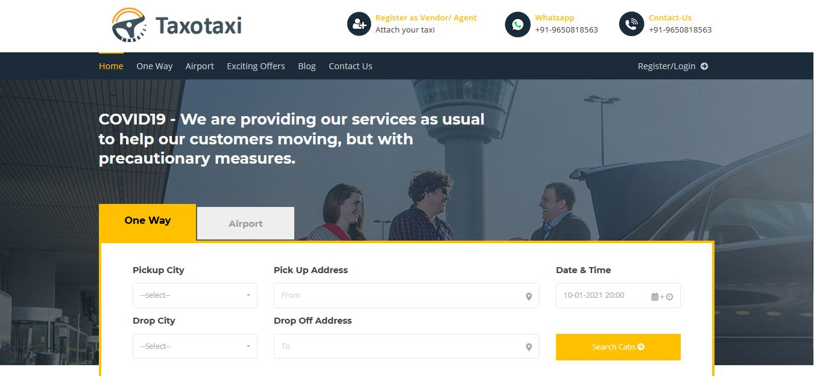
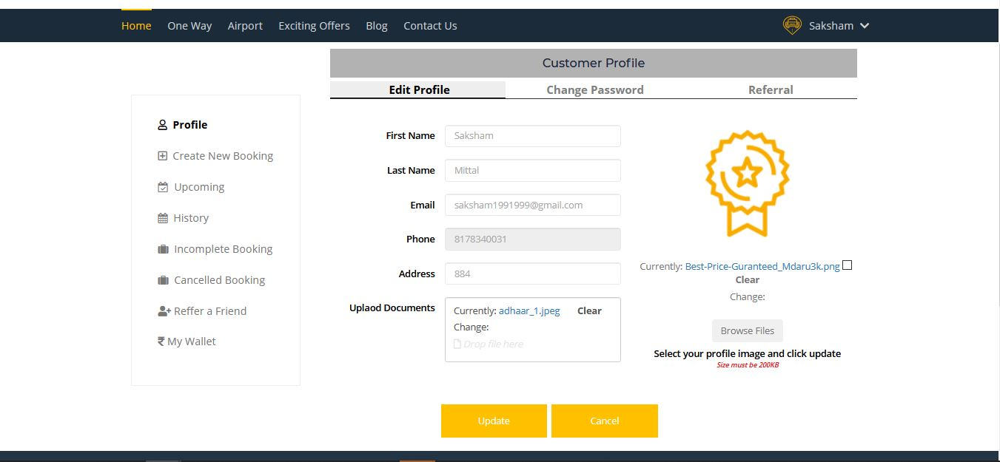
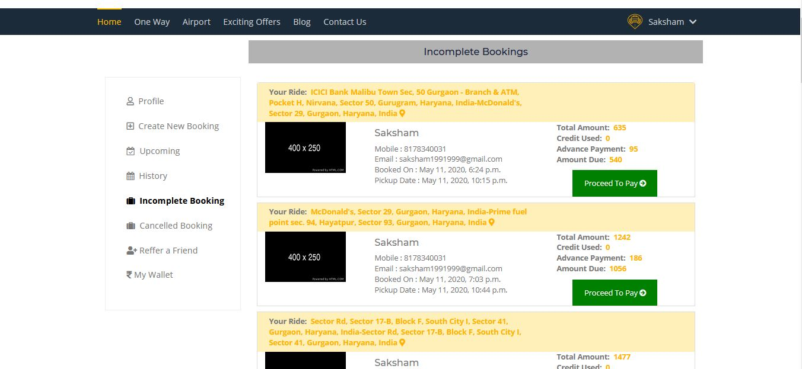
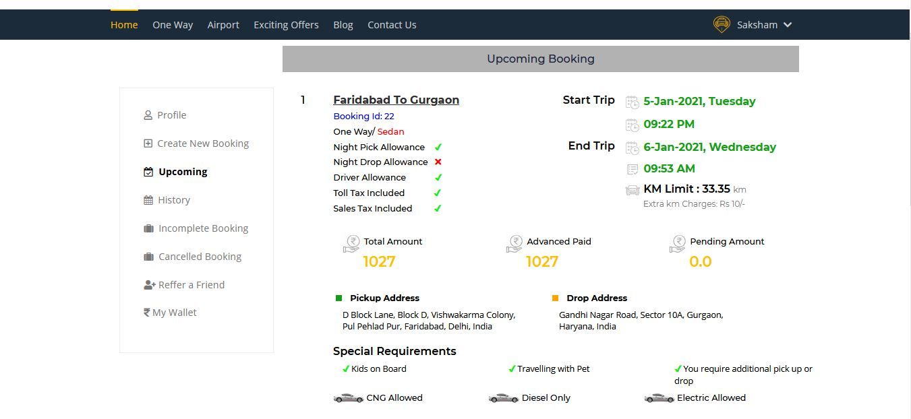
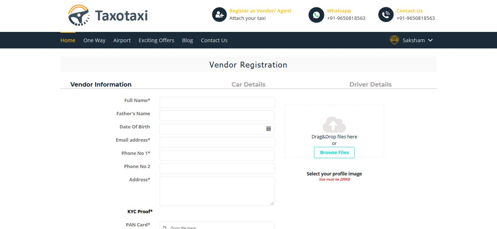
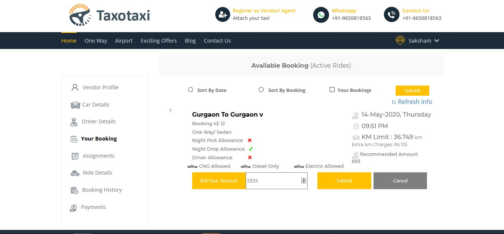
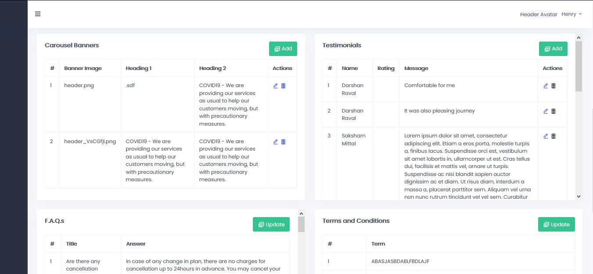
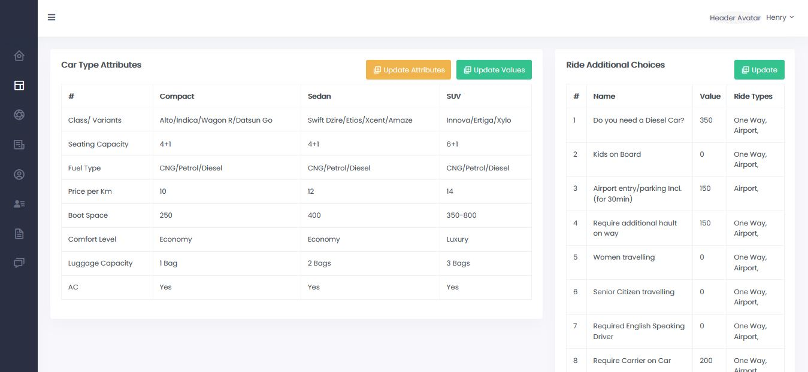
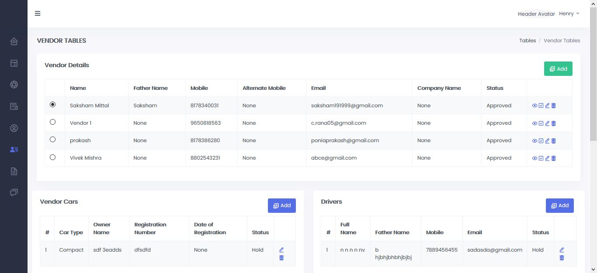

[](https://badges.pufler.dev) [](https://badges.pufler.dev) [](https://badges.pufler.dev)

# [TaxoTaxi.com](https://xunbao.elementsculmyca.com/)
[](https://forthebadge.com)  [](https://forthebadge.com) [](https://forthebadge.com) [](https://forthebadge.com) [](https://forthebadge.com)


## Table of Contents

* [About the Project](#about-the-project)
  * [Built With](#built-with)
* [Getting Started](#getting-started)
  * [Prerequisites](#prerequisites)
  * [Installation](#installation)
  * [Usage](#usage)
* [Frontend](#frontend)
* [Backend](#backend)
    * [Django](#django)
* [Screenshots](#screenshots)
* [Authors](#authors)
* [Contributing](#contributing)
* [License](#license)

## About the Project
[TaxoTaxi](https://xunbao.elementsculmyca.com/) is facilitating a platform to connect customers and drivers. [TaxoTaxi](https://xunbao.elementsculmyca.com/) wanted to expand their business by building a robust and real-time system which will help them to grow. They wanted to create a seamless network of customers, drivers ,cab owners and [TaxoTaxi](https://xunbao.elementsculmyca.com/) to provide best customer experience everyday.

This system also helps TaxoTaxi to track the activity of all the registered Users i.e. drivers/customers/owner.


### Built With
*   Django

[Back to Table of Contents](#table-of-contents)

## Getting Started
### Prerequisites
* Python
* Django


### Installation


* Backend

    ```Python
    pip install -r requirements.txt
    python manage.py makemigrations
    python manage.py migrate
    ```

### Usage

* To Create Super User

    ``` python
    python3 manage.py createsuperuser
    ```
    
    
* To Run Server

    ``` python
    python3 manage.py runserver
    ```
    
[Back to Table of Contents](#table-of-contents)

## Frontend

* #### Django template language
    Django’s template language is designed to strike a balance between power and ease. It’s designed to feel comfortable to those used to working with HTML. If you have any exposure to other text-based template languages, such as Smarty or Jinja2, you should feel right at home with Django’s templates.
    

## Backend

* #### Django 
    Django is a high-level Python Web framework that encourages rapid development and clean, pragmatic design. Built by experienced developers, it takes care of much of the hassle of Web development, so you can focus on writing your app without needing to reinvent the wheel. It's free and open source.
    
    * ###### Why Django ?
        *  Ridiculously fast
        *  Reassuringly secure
        *  Exceedingly scalable
        *  Incredibly versatile
        *  Easy to Integrate with Python Libraries/Functions

## Features

* #### Customer Module
    *  Registration and login for Customer
    *  Customer can Modify his/her profile
    *  Customer can select One Way/Round Trip and Multi City Trip
    *  Customer can have a access of own activity dashboard
    *  Customer can view own trip history
    *  Customer will receive notification for each activity related to him/her.
    *  Customer can pay fare online or offline mode as per the policy
    *  Customers can schedule immediate/later ride as per their convenience
    *  Customer can view the rating of any Driver/Cab
    *  Customer can give the rating for Cab and Driver related to him/her

* #### Vendor/Driver Module
    *  Registration and login for Vendor/Driver
    *  Vendor/Driver can Modify his/her profile
    *  Vendor/Driver can have a access of own activity dashboard
    *  Vendor/Driver can view own schedule ( upcoming rides).
    *  Vendor/Driver will receive notification for each activity related to him/her.
    *  Vendor/Driver can view their ride history (Past Completed Ride).
    *  Vendor/Driver can select the area as per their convenience.(From where they want expect ride)
    *  Vendor/Driver can view the rating of Customer
    *  Vendor/Driver can give the rating for Customer after completing the ride.

* #### Admin Module
  
    *  Enable and Disable Customer/Driver
    *  Admin can have a access for complete dashboard activities
    *  Admin can add/modify the Customer/Driver Details
    *  Admin will receive notification for each activity
    *  Admin can generate weekly/monthly report from activity dashboard
    *  Admin can view total revenue w.r.t. Customer or Driver
    *  Admin can modify fare structure
    *  Admin can modify pickup locations


[Back to Table of Contents](#table-of-contents)
## Screenshots

















